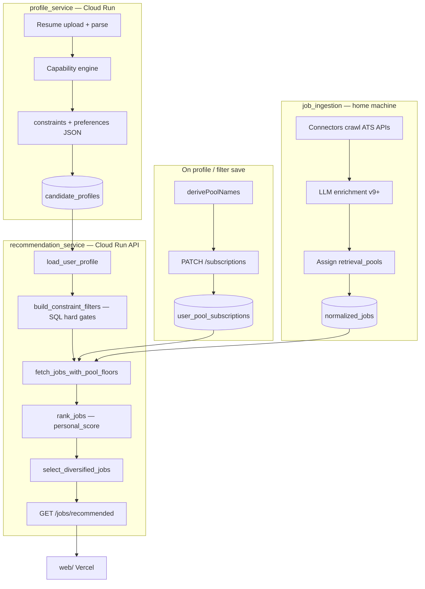

# Recommendation System — Operational Guide

Canonical reference for how personalized job recommendations work in this repo. Intended for engineers and coding agents: read this before diving into the codebase.

**Related docs:** [`recommendation_system_engineering_spec.md`](recommendation_system_engineering_spec.md) (original design spec), [`DEPLOYMENT.md`](DEPLOYMENT.md) (where each service runs), [`domain_taxonomy_spec.md`](domain_taxonomy_spec.md) (job domain filtering).

---

## 1. Architecture at a glance

Recommendations are a **hybrid pipeline**: jobs are ingested and enriched offline; user profiles live in `profile_service`; matching and ranking run in `recommendation_service`; the Next.js app (`web/`) calls the recommendation API.

| Component | Service / path | Role |
|-----------|----------------|------|
| Job crawl + LLM enrichment | `job_ingestion/` (home Linux machine) | Populate `normalized_jobs` with roles, pools, eligibility flags, scores |
| User profile + constraints | `profile_service/` (Cloud Run) | Resume parsing, capabilities, `constraints` / `preferences` JSON |
| Pool subscriptions | `recommendation_service` | `user_pool_subscriptions` — which retrieval pools a user sees |
| Retrieval + ranking + API | `recommendation_service` (Cloud Run API) | Hard filters → score → rank → diversify → `/jobs/recommended` |
| Email digests | `recommendation_service` worker (home machine) | Same filters/scoring; scheduler **disabled** on Cloud Run |
| Frontend | `web/` (Vercel) | Fetches recommendations; optional client-side filters |

All services share one **Supabase Postgres** database. There is no separate recommendation database.

---

## 2. End-to-end flow



**Dashboard recommended path** (`GET /jobs/recommended`):

1. Load active pool subscriptions for `candidate_id`.
2. Load current `candidate_profiles` row + capabilities + evidence.
3. Build SQL hard filters from profile constraints (and optional feature flags).
4. Fetch up to `effective_retrieval_limit` jobs (default 500) with per-pool floors.
5. Score each job → `personal_score`.
6. Deduplicate by `(company, normalized title)`.
7. Diversify by company share cap + apply-history unlock.
8. Paginate and attach `match_reasons` + H1B / company enrichment.

---

## 3. Job data model (`normalized_jobs`)

Jobs must pass **base eligibility** before retrieval:

- `is_active = true`
- `processing_state = 'success'`
- `opportunity_score IS NOT NULL`
- `retrieval_pools` overlaps user's subscribed pools

### Enrichment fields used by recommendations

| Column | Type | Used for |
|--------|------|----------|
| `retrieval_pools` | `text[]` | **Gate 1** — pool subscription match (e.g. `BACKEND_ENGINEER_FULLTIME`) |
| `normalized_roles` | `text[]` | H1B pool-family lookup; display |
| `job_capabilities` | `text[]` | Scoring (40% weight default) |
| `tech_stack`, `skills` | `text[]` | Scoring (25% weight default) |
| `role_intent` | `string` | Hard filter when `role_intent_filter_enabled` |
| `job_domain`, `job_secondary_domain` | `string` | Hard filter when `domain_filter_enabled` |
| `requires_clearance` | `bool` | Hard filter when user `has_clearance = false` |
| `requires_citizenship` | `bool` | Hard filter when user `sponsorship_required = true` |
| `sponsorship_status` | `yes/no/unclear` | Display + optional H1B **scoring** boost (not a hard filter) |
| `seniority`, `experience_tier` | `string` | Hard filter + score multiplier / tier scoring |
| `salary_min`, `salary_max` | `int` | Hard min-salary filter + comp score |
| `remote_type`, `location`, `job_country` | | Location score |
| `opportunity_score` | `float` | Tie-break after `personal_score`; pool-floor ordering |
| `reference_at` | `timestamp` | Freshness; notification age filter |

### How eligibility flags are set (ingestion)

**Source:** `job_ingestion/app/ingestion/extractor/llm.py` + `constants_taxonomy.py` prompt rules, plus deterministic backup in `extractor/eligibility.py`.

| Field | `true` when | `false` when |
|-------|-------------|--------------|
| `requires_clearance` | JD **explicitly** requires a security clearance | Not mentioned, vague, or only background check |
| `requires_citizenship` | JD explicitly requires US citizens/persons **or** says no visa sponsorship | Ambiguous, silent, or explicitly sponsors |

Design principle: **anti-filters** — only hide jobs we are **sure** are incompatible. Ambiguous jobs stay in the pool.

After LLM extraction, `apply_eligibility_signals()` runs regex patterns on `description_text` and only flips `false → true` (never the reverse).

WorkAtAStartup structured `visa_sponsorship: false` → sets `requires_citizenship = true`.

Current extraction version: **v9** (`job_ingestion/app/config.py`).

### Retrieval pools

Pools are assigned at enrichment from `normalized_roles` + employment type:

```
{ROLE}_{FULLTIME|INTERNSHIP|NEW_GRAD}
```

Example: `BACKEND_ENGINEER_FULLTIME`, `ML_ENGINEER_INTERNSHIP`.

Logic: `job_ingestion/app/ingestion/recommendation_fields.py` → `assign_validated_retrieval_pools()`.

---

## 4. User profile model

Stored in `candidate_profiles` (owned by `profile_service`). Recommendation service reads the **current** row (`is_current = true`).

### `constraints` (hard filters)

| Key | Effect on retrieval |
|-----|---------------------|
| `sponsorship_required` | Exclude `requires_citizenship = true` |
| `has_clearance` | If `false` (default), exclude `requires_clearance = true` |
| `internship_only` | Only `is_internship = true` |
| `fulltime_only` | Only `is_internship = false` |
| `minimum_salary` | Exclude jobs where `salary_max < minimum` (null salary passes) |
| `target_seniority` | Allowed/blocked `seniority` values (when tier visibility off) |
| `visa_type`, `work_authorization` | Auto-set `sponsorship_required` via `profile_service/app/utils/constraints.py` |
| `eeo.requires_sponsorship` | Also auto-sets `sponsorship_required` on profile save |

### `preferences` (soft scoring + optional hard filters)

| Key | Effect |
|-----|--------|
| `primary_roles`, `role_pool_ids` | Drive pool subscription sync |
| `primary_role_intents`, `pool_role_intents` | Role-intent hard filter when enabled |
| `preferred_locations`, `preferred_countries`, `remote_preference` | Location score |
| `work_models` | Frontend filter only (not backend hard gate today) |

### Capabilities + skills

- `candidate_capabilities` (per profile version) → capability overlap score.
- `candidate_profiles.skills` JSON → skill overlap score.

---

## 5. Pool subscriptions

Table: `user_pool_subscriptions` (`candidate_id`, `pool_name`, `is_active`).

**Synced from the frontend** when the user saves filters or completes onboarding:

```
web/lib/recommendation/sync-subscriptions.ts
  → derivePoolNames(profile)     # web/lib/recommendation/pools.ts
  → PATCH /subscriptions/{id}    # recommendation_service
  → sync_pool_role_intents()     # writes preferences.pool_role_intents on profile
```

Pool derivation order:

1. `preferences.role_pool_ids` if set
2. Else `poolIdsForRoles(primary_roles, FULLTIME|INTERNSHIP|NEW_GRAD)`

If a user has **no active subscriptions**, `/jobs/recommended` returns empty.

---

## 6. Hard filters (`build_constraint_filters`)

**File:** `recommendation_service/app/notification/retrieval.py`

Applied as SQL `WHERE` clauses **before** scoring. Jobs that fail never reach the ranker.

| Condition | Filter |
|-----------|--------|
| Always (user lacks clearance) | `requires_clearance IS FALSE` |
| `sponsorship_required` | `requires_citizenship IS FALSE` |
| `role_intent_filter_enabled` | `role_intent IN (user intents)` |
| `domain_filter_enabled` | `job_domain` / `job_secondary_domain` match candidate domains |
| `internship_only` / `fulltime_only` | `is_internship` |
| `minimum_salary` | `salary_max >= min OR salary_max IS NULL` |
| Seniority / experience tier | Per `experience_tier_visibility_enabled` or `target_seniority` |

**Not hard-filtered:** `sponsorship_status` (`yes`/`no`/`unclear`). Ambiguous sponsorship jobs remain visible unless `requires_citizenship` is explicitly `true`.

**Note:** `clearance_filter_enabled` env var exists but clearance filtering is **always applied** when `has_clearance` is false (as of v9 eligibility work).

---

## 7. Retrieval strategy

### Pool floors (`fetch_jobs_with_pool_floors`)

Prevents one pool from dominating the candidate set:

1. For each subscribed pool, fetch `floor_ratio × cap / num_pools` top jobs by `opportunity_score`.
2. Fill remaining slots from all pools combined, ordered by `opportunity_score`.

Defaults: `cap = 500`, `floor_ratio = 0.1`.

### Notifications vs dashboard

| Path | Age filter | Previously sent | Ranking cap |
|------|------------|-----------------|-------------|
| Dashboard `/jobs/recommended` | No | No | `effective_retrieval_limit` then diversify |
| Email digest | `reference_at` within `job_max_age_days` | Excludes `notification_job_history` | `default_digest_top_k` (4) |

---

## 8. Personal scoring

**File:** `recommendation_service/app/scoring/recommendation.py`

Default weights (no sponsorship/tier scoring):

| Signal | Weight |
|--------|--------|
| Capability overlap | 40% |
| Skill overlap | 25% |
| Location alignment | 20% |
| Compensation alignment | 15% |

Optional modes (env flags):

- **`sponsorship_score_enabled`** — adds H1B LCA history boost when `sponsorship_required`; reweights other signals. Does **not** hard-filter.
- **`experience_tier_score_enabled`** — adds experience-tier distance score; replaces seniority multiplier.

Seniority multiplier (`seniority_score_multiplier`) applies when tier scoring is off.

### Ranking tie-break (`rank_jobs`)

Sort key (descending):

1. `personal_score`
2. `opportunity_score`
3. `reference_at` (or `posted_at` / `created_at`)

### Post-ranking

1. **`deduplicate_ranked_jobs`** — same company + normalized title → keep highest score.
2. **`select_diversified_jobs`** — cap each company's share (`recommendation_max_company_share`, default 3%); unlock more slots per company as user applies (`recommendation_company_unlock_batch`).

### Match reasons

**File:** `recommendation_service/app/scoring/explainability.py`

Up to 5 strings: overlapping capabilities, tech stack skills, then evidence keywords. Returned as `match_reasons` on recommended jobs.

---

## 9. API surface (`recommendation_service`)

Router prefix: dashboard routes are under the app root (no `/api` prefix).

| Endpoint | Purpose |
|----------|---------|
| `GET /jobs/recommended?candidate_id=` | Personalized ranked feed |
| `GET /jobs?candidate_id=` | Pool jobs sorted by `opportunity_score` (not personal score) |
| `GET /jobs/{id}?candidate_id=` | Single job detail (must be in user's pools) |
| `POST /subscriptions` | Create pool subscriptions |
| `PATCH /subscriptions/{id}` | Replace active pools |
| `GET /subscriptions/{id}` | List subscriptions |
| `POST /jobs/{id}/apply` | Record application |
| `GET /applications?candidate_id=` | List applications |

Job response includes: `requires_clearance`, `requires_citizenship`, `sponsorship_status`, optional `h1b_sponsorship`, `company_info`, and on recommended jobs: `personal_score`, `match_reasons`.

---

## 10. Frontend (`web/`)

| File | Role |
|------|------|
| `components/jobs-provider.tsx` | Fetches `/jobs/recommended` + `/jobs`; holds feed state |
| `components/jobs/neural-recommendations-page.tsx` | Recommended UI; **optional** client filters via `advancedFilters` |
| `lib/recommendation/sync-subscriptions.ts` | Syncs pools after profile/filter save |
| `lib/profile/job-filters.ts` | Maps profile ↔ filter state; writes constraints to profile API |
| `lib/filters/match-estimate.ts` | Client-side filter preview (should not duplicate backend hard gates) |

**Important:** Backend hard filters apply only when constraints are saved on the profile. The recommendations page does not apply profile filters on initial load unless the user opens and confirms the filter panel (`advancedFilters` starts `null`).

Production frontend talks to **Cloud Run** recommendation + profile APIs (see `DEPLOYMENT.md`).

---

## 11. Feature flags (recommendation_service env)

| Variable | Default | Effect |
|----------|---------|--------|
| `DOMAIN_FILTER_ENABLED` | `false` | Aerospace/defense domain hard filter |
| `ROLE_INTENT_FILTER_ENABLED` | `false` | Filter by engineer/researcher/etc. intents |
| `SPONSORSHIP_SCORE_ENABLED` | `false` | H1B history in ranking (not filtering) |
| `EXPERIENCE_TIER_VISIBILITY_ENABLED` | `false` | Hide jobs above tier ceiling |
| `EXPERIENCE_TIER_SCORE_ENABLED` | `false` | Tier distance in personal score |
| `RECOMMENDATION_RETRIEVAL_LIMIT` | `500` | Max jobs fetched before ranking |
| `RECOMMENDATION_POOL_FLOOR_RATIO` | `0.1` | Per-pool minimum share |
| `RECOMMENDATION_MAX_COMPANY_SHARE` | `0.03` | Max fraction of feed from one company |
| `ENABLE_NOTIFICATION_SCHEDULER` | `true` | **`false` on Cloud Run** — emails run on home machine only |
| `JOB_MAX_AGE_DAYS` | `7` | Notification retrieval freshness window |

---

## 12. Key files index

### Ingestion → job fields

| File | Responsibility |
|------|----------------|
| `job_ingestion/app/ingestion/enrichment_worker.py` | Batch enrichment write-back |
| `job_ingestion/app/ingestion/extractor/llm.py` | LLM schema (`requires_clearance`, `requires_citizenship`, …) |
| `job_ingestion/app/ingestion/extractor/eligibility.py` | Deterministic regex backup |
| `job_ingestion/app/ingestion/constants_taxonomy.py` | LLM prompt rules for eligibility |
| `job_ingestion/app/ingestion/recommendation_fields.py` | Pool assignment + `opportunity_score` |

### Profile → constraints

| File | Responsibility |
|------|----------------|
| `profile_service/app/pipeline/patch_engine.py` | Profile version writes |
| `profile_service/app/utils/constraints.py` | Auto `sponsorship_required` from EEO/visa |

### Recommendation core

| File | Responsibility |
|------|----------------|
| `recommendation_service/app/notification/retrieval.py` | Hard filters + pool fetch |
| `recommendation_service/app/scoring/recommendation.py` | `score_job()` |
| `recommendation_service/app/notification/ranker.py` | Rank, dedup, diversify |
| `recommendation_service/app/api/dashboard.py` | `/jobs/recommended` orchestration |
| `recommendation_service/app/services/profile_loader.py` | `UserProfile` dataclass |
| `recommendation_service/app/notification/digest.py` | Email digest pipeline |

### Scripts

| File | Responsibility |
|------|----------------|
| `scripts/run_user_recommendations.py` | Offline recommendation report per user |
| `scripts/generate_testing_results_md.py` | Markdown report from JSON export |

---

## 13. Operations playbook

### After changing recommendation filter logic

1. **Redeploy** `recommendation-service` on Cloud Run (restart ≠ new code).
2. If profile constraint logic changed → redeploy `profile-service` too.
3. No migration needed unless new DB columns.

### After changing job enrichment / eligibility

1. Deploy/restart `job_ingestion` on home machine.
2. Run DB migration if new columns (`job_ingestion/alembic upgrade head`).
3. **Reprocess** active jobs to new `extraction_version` (v9+) so `requires_citizenship` / updated `requires_clearance` populate.
4. Redeploy recommendation service if API response shape changed.

### Verify a user's recommendations

```bash
# Offline report for all users with profiles
python scripts/run_user_recommendations.py
# → exports/user_recommendations.json + testing_results.md
```

SQL spot-checks:

```sql
-- User constraints
SELECT constraints FROM candidate_profiles
WHERE candidate_id = '<uuid>' AND is_current;

-- Active pools
SELECT pool_name FROM user_pool_subscriptions
WHERE candidate_id = '<uuid>' AND is_active;

-- Job eligibility flags
SELECT company_name, title, requires_clearance, requires_citizenship, sponsorship_status
FROM normalized_jobs
WHERE company_name ILIKE '%anduril%' AND is_active;
```

---

## 14. Debugging common issues

### International student sees defense / no-sponsorship companies

Check in order:

1. **Profile:** `constraints.sponsorship_required` — is it `true`? (Onboarding may leave it `false` unless EEO/visa set or user saves filter panel.)
2. **Job enrichment:** `requires_citizenship` / `requires_clearance` on those rows — still `false`? → reprocess with v9+.
3. **Deployment:** Cloud Run running old recommendation code?
4. **Frontend:** Client showing API results without backend filters; `advancedFilters` null on first load.

### Empty recommendations

1. No active pool subscriptions → sync subscriptions.
2. Hard filters too aggressive → check constraints vs available job corpus.
3. `role_intent_filter_enabled` / `domain_filter_enabled` with narrow profile.

### Stale eligibility after JD changes

Re-enrichment only runs on active crawl cycle. Reprocessor/backfill needed for one-off updates.

### Pool mismatch

`primary_roles` in profile don't match `retrieval_pools` on jobs → check `derivePoolNames` vs enrichment `normalized_roles`.

---

## 15. Ranking modes summary

| Mode | Endpoint / script | Sort by | Filters |
|------|-------------------|---------|---------|
| **Personalized** | `GET /jobs/recommended` | `personal_score` | Full hard filters + diversify |
| **Browse pool** | `GET /jobs` | `opportunity_score` | Hard filters; no personal rank |
| **Email digest** | Home worker | `personal_score` | Hard filters + age + not-previously-sent |
| **Offline report** | `run_user_recommendations.py` | `personal_score` | Same as personalized |

`opportunity_score` = global job quality (freshness + comp + application effort). Used for pool ordering and tie-breaks, not as the primary personalized rank.

---

## 16. Change log (eligibility v9)

As of extraction **v9**:

- Added `requires_citizenship` column on `normalized_jobs` / `job_archive`.
- Clearance filter always on when `has_clearance = false`.
- Sponsorship hard filter uses `requires_citizenship IS FALSE` (not `sponsorship_status != 'no'`).
- Profile service auto-sets `sponsorship_required` from EEO / visa / work authorization.

Frontend still needs updates to display new fields and remove duplicate client-side sponsorship filtering (see team handoff in prior implementation notes).
