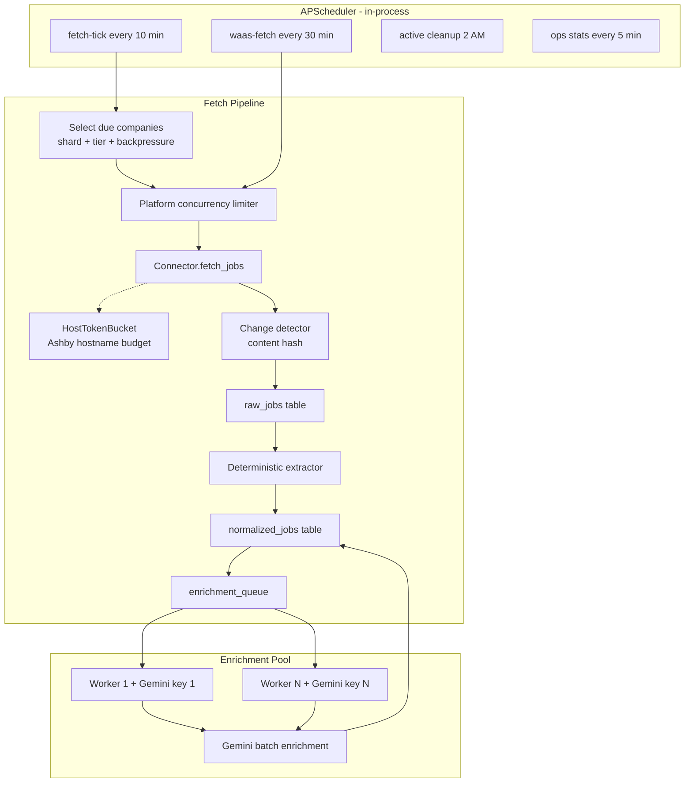

# Job Ingestion Guide (For External Recommenders)

## 1. Purpose

We run a **multi-platform job ingestion service** that:

1. Crawls public ATS career boards (Greenhouse, Ashby, Workday, etc.)
2. Detects new/changed/removed jobs
3. Normalizes fields deterministically (no LLM)
4. Enriches jobs asynchronously with **Google Gemini** (skills, seniority, sponsorship, opportunity score)
5. Feeds a downstream **job recommendation product** (separate service; shares `JOB_MAX_AGE_DAYS=7`)

The service is a **FastAPI app on port 8000**, backed by **PostgreSQL**, with in-process **APScheduler** and **enrichment worker pool**.

---

## 2. Scale (current production target)

| Dimension | Count |
|-----------|-------|
| Companies in catalog | 256 |
| Active companies | **254** |
| Active Ashby companies | **50** |
| Fetch tiers | Tier 1: 9 · Tier 2: 162 · Tier 3: 83 |

**Active companies by platform:**

| Platform | Count | Fetch pattern |
|----------|------:|---------------|
| `greenhouse` | 80 | Single API call (descriptions included) |
| `workday` | 65 | List + incremental detail |
| `ashby` | 50 | List + incremental detail (global `HostTokenBucket` on `jobs.ashbyhq.com`) |
| `lever` | 24 | Single API call |
| `oracle_hcm` | 10 | Paginated list + detail |
| `smartrecruiters` | 7 | Connector-specific |
| `icims` | 6 | Sitemap + detail |
| Others | 12 | bamboohr, rippling, workable, successfactors, google_careers, amazon_jobs, workatastartup |

**Freshness window:** Jobs older than **7 days** (`JOB_MAX_AGE_DAYS`) are rejected at fetch/pipeline/enrichment and purged nightly.

---

## 3. High-level architecture



**Key design principle:** Fetch and enrichment are **decoupled**. Fetch failures block a company run; enrichment failures do **not** roll back ingested jobs.

---

## 4. End-to-end pipeline (per company)

```
Company (platform + board_token + fetch_tier)
    │
    ▼
Connector.fetch_jobs()          → platform-native dicts
    │
    ▼
filter_fetched_jobs()           → reject stale posted_at (JOB_MAX_AGE_DAYS)
    │
    ▼
classify_jobs()                 → new | updated | unchanged | removed (by content hash)
    │
    ▼ (new/updated only)
RawJob                          → raw_api_response + raw_html + content_hash
    │
    ▼
extract_deterministic_fields()  → title, location, posted_at, description_text, etc.
    │
    ▼
NormalizedJob                   → processing_state = pending
    │
    ▼
enrichment_queue                → status = queued
    │
    ▼ (async workers)
Gemini batch enrichment         → skills, seniority, sponsorship, opportunity_score
    │
    ▼
NormalizedJob                   → processing_state = complete / partial_success / enrichment_failed
```

**Connector contract:** Each connector implements `async def fetch_jobs(company) -> list[dict]`. Connectors return **platform-native JSON**, not normalized rows. Normalization is in `deterministic.py`.

**Cache-aware fetch:** `workday` and `ashby` also accept optional `known_raw_by_id` and `known_raw_fetched_at` kwargs (loaded from `raw_jobs` by the pipeline) to skip unchanged detail fetches on re-poll.

**Registration:** `job_ingestion/app/ingestion/fetcher.py` maps platform string → connector class.

---

## 5. Company catalog

**Source of truth:** `job_ingestion/data/companies.json`

```json
{
  "company": "Notion",
  "platform": "ashby",
  "board_token": "notion",
  "fetch_tier": 1,
  "is_active": true
}
```

| Field | Meaning |
|-------|---------|
| `platform` | Connector key |
| `board_token` | Unique slug on that ATS (globally unique in our DB) |
| `fetch_tier` | 1 = freshest, 3 = slowest poll cadence |
| `is_active` | Include in fetch runs |
| `platform_config` | Optional JSON (Workday tenant URL, careers URL overrides, etc.) |

Sync to DB: `POST /companies/seed` (strict sync — removes DB companies not in JSON).

---

## 6. Fetch scheduling

Configured via **`FETCH_SCHEDULE_JSON`** in `.env` (or built-in defaults in `fetch_schedule_config.py`).

### How companies get selected each tick

1. **Due check:** `now - last_successful_fetch_at >= interval(platform, tier)`
2. **Shard filter:** `crc32(board_token) % num_shards == tick % num_shards`  
   - Spreads companies across time  
   - `num_shards = ceil(interval_minutes / tick_minutes)`  
   - Example: Ashby tier 2 → 480 min interval, 10 min tick → **48 shards** → ~1 Ashby company per tick on average
3. **Batch cap:** Max **200** companies per tick
4. **Backpressure filter:** May drop tier-3 (or halt all) if enrichment queue is deep

### Default intervals (minutes)

| Platform | Tier 1 | Tier 2 | Tier 3 |
|----------|--------|--------|--------|
| workatastartup | 30 | — | — |
| greenhouse / lever | 45 | 180 | 720 |
| **ashby** | 120 | **480** | 1440 |
| workday | 240 | 720 | 2880 |
| oracle_hcm / icims | 360 | 1440 | 2880 |

Additional platforms (`smartrecruiters`, `bamboohr`, `successfactors`, `google_careers`, `amazon_jobs`, etc.) have defaults in [`fetch_schedule_config.py`](job_ingestion/app/ingestion/fetch_schedule_config.py).

### Platform throttles (concurrent companies per pipeline run)

| Platform | Concurrency | Inter-company delay |
|----------|-------------|---------------------|
| default | 8 | 0 |
| **ashby** | **1** | **3s** |
| workday | 3 | 1s |
| oracle_hcm | 2 | — |
| icims / successfactors | 1 | — |
| smartrecruiters / bamboohr | 3 | — |

**Rate limiting layers (Ashby):** Platform throttles cap how many Ashby **companies** run concurrently per pipeline batch. Separately, all Ashby HTTP calls (list + detail, any company, any tick) share a process-wide **`HostTokenBucket`** in `app/ingestion/rate_limiter.py`, keyed on `jobs.ashbyhq.com`. Tune via `ASHBY_HOST_RATE_PER_SECOND` (default 1.5) and `ASHBY_HOST_BURST` (default 3). This is the primary guard against cross-company 429 bursts; platform concurrency is a secondary cap.

### Scheduler jobs

| Job | Cadence | Purpose |
|-----|---------|---------|
| `fetch-tick` | Every `tick_minutes` (10) | Main batch fetch |
| `waas-fetch` | Every 30 min | WorkAtStartup only (dedicated) |
| `ops-stats` | Every 5 min | Write `exports/ingestion_stats.json` |
| `active_cleanup` | Daily 2:00 AM | Purge stale jobs |
| `archive_cleanup` | Daily 2:30 AM | Archive retention |
| `yc-directory-crawl` | Sunday 1:00 AM | Discover new YC companies |

`max_instances=1` on fetch jobs prevents overlapping **scheduled** ticks, but manual `POST /pipeline/trigger?scope=full` can still overlap.

---

## 7. Fetch backpressure (enrichment-driven)

When enrichment backlog is too large, fetch ingress throttles so Gemini can catch up.

| Env var | Default | Meaning |
|---------|---------|---------|
| `FETCH_BACKPRESSURE_ENABLED` | `true` | Master switch |
| `FETCH_BACKPRESSURE_QUEUE_THRESHOLD` | `2000` | Trigger when `queued + cooldown + in_progress >= threshold` |
| `FETCH_BACKPRESSURE_MODE` | `skip_tiers` | Drop tier-3 companies from batch |
| `FETCH_BACKPRESSURE_SKIP_TIERS` | `3` | Tiers to skip |
| `FETCH_BACKPRESSURE_ALLOW_WAAS` | `true` | Keep WAAS running under `halt_all` |

Manual backfill bypass: `POST /pipeline/trigger?scope=full&force=true`

This backpressure is **enrichment-queue-depth-driven**, not Ashby-429-driven.

---

## 8. Enrichment pipeline

Runs as an **in-process worker pool** started in FastAPI lifespan (`app/main.py`).

| Env var | Default | Meaning |
|---------|---------|---------|
| `GEMINI_API_KEYS` | — | Comma-separated keys (primary) |
| `GEMINI_API_KEY` | — | Fallback single key |
| `ENRICHMENT_WORKER_COUNT` | # of keys | Worker pool size |
| `GEMINI_MODEL` | `gemini-3.1-flash-lite` | Model |
| `EXTRACTION_VERSION` | `v6` | Prompt/schema version |
| `ENRICHMENT_LLM_MAX_RPM` | 10 | Per-worker RPM cap |
| `ENRICHMENT_MICRO_BATCH_SIZE` | 12 | Jobs per Gemini call |
| `ENRICHMENT_WINDOW_SECONDS` | 45 | Rate window |
| `ENRICHMENT_MAX_JOBS_PER_WINDOW` | 64 | Cap per window |
| `ENRICHMENT_COOLDOWN_SECONDS` | 120 | Retry delay on transient failure |
| `ENRICHMENT_MAX_RETRIES` | 3 | Max attempts |
| `ENRICHMENT_MAX_INPUT_TOKENS_PER_BATCH` | 14000 | Batch token cap |
| `ENRICHMENT_WINDOW_TOKEN_BUDGET` | 200000 | Window token budget |

**Throughput:** ~ `N workers × ENRICHMENT_LLM_MAX_RPM` Gemini calls/minute.

**Partitioning:** Queue rows partitioned by `hash(normalized_job_id) % worker_count` so workers don't double-claim.

**Gemini 429 vs Ashby 429:** Gemini rate limits appear in enrichment worker logs (transient retry / cooldown). Ashby 429s appear as httpx lines on `jobs.ashbyhq.com/api/non-user-graphql?op=ApiJobPosting`. The log line `AFC is enabled with max remote calls: 10` is **Gemini Automatic Function Calling**, not Ashby.

---

## 9. Freshness and job lifecycle

| Stage | Mechanism |
|-------|-----------|
| Fetch | `filter_fetched_jobs()` rejects verifiably stale `posted_at` |
| Pipeline | Second stale check before DB write |
| Pre-enrichment | Purge before Gemini call |
| Post-enrichment | Re-check posted_at after extraction |
| Nightly cleanup | Delete jobs with `posted_at` > 7 days old |
| Removal detection | Jobs missing from fetch for `CONSECUTIVE_MISSES_BEFORE_INACTIVE=3` cycles → inactive |

Jobs with **unknown** posting date pass fetch filters and are kept (v1 behavior).

---

## 10. Failure handling and alerts

| Event | Trigger |
|-------|---------|
| `SOURCE_FETCH_FAILED` | Any exception in company fetch (e.g. Ashby list failure, or all job details fail with no cache) |
| `SOURCE_FAILURE_THRESHOLD_REACHED` | `consecutive_fetch_failures >= 3` (2 for rippling) |
| `SOURCE_RECOVERED` | Successful fetch after prior failures |

Alerts written to `ALERTS_FILE_PATH` (default `./alerts.json`).

**Ashby partial failure behavior:** A single job detail failure no longer fails the whole company. The connector falls back to cached `raw_jobs` data, then listing-only data (to avoid false removal detection), then retries failed IDs in a second pass. The company fetch only raises `ConnectorFetchError` when the list call fails or **every** job detail fails with no usable cache.

---

## 11. Database entities (core tables)

| Table | Role |
|-------|------|
| `companies` | Source config mirror; tracks `last_successful_fetch_at`, `consecutive_fetch_failures`, `fetch_tier` |
| `pipeline_runs` | Batch run metadata + `schedule_metadata` JSON |
| `company_run_results` | Per-company stats per run |
| `raw_jobs` | Immutable platform JSON + `content_hash` per fetch |
| `normalized_jobs` | Canonical job record for product |
| `enrichment_queue` | Async work queue (`queued`, `in_progress`, `cooldown`, `quota_blocked`, etc.) |
| `job_enrichments` | LLM output per extraction version |
| `events` | Operational event stream for dashboard |

---

## 12. API surface (operational)

| Method | Path | Purpose |
|--------|------|---------|
| `POST` | `/pipeline/trigger` | Due batch (same as scheduler tick) |
| `POST` | `/pipeline/trigger?scope=full` | All active companies (**high load**) |
| `POST` | `/pipeline/trigger?scope=full&force=true` | Full fetch ignoring enrichment backpressure |
| `GET` | `/pipeline/runs` | Run history |
| `GET` | `/stats` | Live ops snapshot |
| `POST` | `/companies/seed` | Sync companies.json → DB |
| `POST` | `/maintenance/enrichment/reset-stuck` | Re-queue stuck enrichment rows |

Swagger: `http://localhost:8000/docs`

---

## 13. Configuration reference (from `.env.example`)

### Infrastructure

| Variable | Purpose |
|----------|---------|
| `DATABASE_URL` | PostgreSQL async connection |
| `LOG_LEVEL` | Logging verbosity |
| `SHUTDOWN_WORKER_TIMEOUT_SECONDS` | Graceful worker shutdown (30s) |

### Fetch scheduling

| Variable | Purpose |
|----------|---------|
| `FETCH_SCHEDULE_JSON` | Tick interval, tier intervals, platform throttles, batch cap |
| `FETCH_BACKPRESSURE_*` | Enrichment-driven fetch throttling |
| `ASHBY_HOST_RATE_PER_SECOND` | Global req/s cap for all Ashby GraphQL calls (default 1.5) |
| `ASHBY_HOST_BURST` | Burst allowance for Ashby host bucket (default 3) |
| `ASHBY_FULL_REFRESH_DAYS` | Re-fetch Ashby detail even when listing metadata unchanged (default 7) |
| `MAX_CONSECUTIVE_FAILURES_BEFORE_ALERT` | Default 3 |
| `CONSECUTIVE_MISSES_BEFORE_INACTIVE` | Default 3 |

### Enrichment

| Variable | Purpose |
|----------|---------|
| `LLM_PROVIDER` | `gemini` |
| `GEMINI_API_KEYS` / `GEMINI_API_KEY` | API credentials |
| `GEMINI_MODEL` | Model selection |
| `EXTRACTION_VERSION` | Schema/prompt version |
| `ENRICHMENT_*` | Batching, RPM, retries, token budgets |
| `OPPORTUNITY_SCORE_FRESHNESS_DECAY` | Scoring tuning |
| `COMP_FLOOR` / `COMP_CEILING` | Compensation normalization bounds |

### Maintenance

| Variable | Purpose |
|----------|---------|
| `JOB_MAX_AGE_DAYS` | 7 — must match recommendation service |
| `ARCHIVE_RETENTION_DAYS` | 100 |
| `CLEANUP_BATCH_SIZE` | 500 |
| `ARCHIVE_DIR` | `data/archives` |
| `ALERTS_FILE_PATH` | `./alerts.json` |
| `INGESTION_STATS_FILE_PATH` | `exports/ingestion_stats.json` |
| `INGESTION_STATS_INTERVAL_MINUTES` | 5 |

### YC discovery (optional)

| Variable | Purpose |
|----------|---------|
| `YC_CRAWLER_EMAIL` / `YC_CRAWLER_PASSWORD` | WorkAtStartup auth |
| `YC_DIRECTORY_PROBE_CONCURRENCY` | 5 |
| `YC_WAAS_ROLES` | `eng,ds,pm` |

---

## 14. Ashby connector specifics

Ashby is the most rate-sensitive connector because descriptions require a per-job detail call. We previously saw HTTP 429 bursts when multiple boards fetched concurrently; the implementation below addresses that.

### API

| Step | Endpoint | Returns |
|------|----------|---------|
| List | `POST …/op=ApiJobBoardWithTeams` | IDs, titles, locations — **no description** |
| Detail × N | `POST …/op=ApiJobPosting` | `descriptionHtml`, `publishedDate`, department |

Auth: **none** (public GraphQL).  
Implementation: [`job_ingestion/app/ingestion/connectors/ashby.py`](job_ingestion/app/ingestion/connectors/ashby.py)

### Fetch flow (current)

1. **List** all postings via GraphQL (`ApiJobBoardWithTeams`).
2. For each posting, decide whether detail is needed:
   - **Skip detail** if cached `raw_jobs` entry exists, listing fingerprint unchanged, `descriptionHtml` present, and cache age `< ASHBY_FULL_REFRESH_DAYS`.
   - **Fetch detail** otherwise via `ApiJobPosting`.
3. On detail failure: fall back to cache → listing-only merge → second-pass retry for IDs that failed without cache.
4. Merge list + detail (or cache) and set `externalLink`.

Pipeline passes `known_raw_by_id` / `known_raw_fetched_at` from [`pipeline.py`](job_ingestion/app/ingestion/pipeline.py) through [`fetcher.py`](job_ingestion/app/ingestion/fetcher.py) (same pattern as Workday).

### Rate control (current)

| Mechanism | Setting | Role |
|-----------|---------|------|
| `HostTokenBucket` | `ASHBY_HOST_RATE_PER_SECOND=1.5`, `ASHBY_HOST_BURST=3` | **Primary** — all list/detail POSTs acquire one token before HTTP |
| Platform throttle | `concurrency: 1`, `inter_company_seconds: 3` | Secondary — at most one Ashby company fetch loop active per batch |
| Per-company semaphore | `detail_concurrency = 1` | Sequential detail calls within one company |
| 429 retry | 5 attempts | Honors `Retry-After` header when present; else exponential backoff (2s base) |
| Incremental cache | `ASHBY_FULL_REFRESH_DAYS=7` | Skips detail for unchanged listings on re-fetch |
| Sharded schedule | tier 2 → 480 min / 48 shards | ~1 Ashby board due per 10-min tick on average |

Module: [`job_ingestion/app/ingestion/rate_limiter.py`](job_ingestion/app/ingestion/rate_limiter.py)

### Structured logs (Ashby)

| Event | When |
|-------|------|
| `ashby_incremental_fetch_complete` | End of company fetch — reports `detail_fetched`, `cache_reused`, `total` |
| `ashby_detail_fetch_failed` | Single job detail failed — notes `used_cache` if cache fallback applied |
| `ashby_partial_detail_failure` | One or more jobs needed fallback/retry — reports `failed_count`, `second_pass_recovered` |

### Tuning after deploy

1. Watch httpx logs for `429` on `op=ApiJobPosting`.
2. If 429s persist, lower `ASHBY_HOST_RATE_PER_SECOND` (e.g. 1.0).
3. If no 429s for several days and fetch latency is acceptable, cautiously increase rate.
4. Confirm `ashby_incremental_fetch_complete` shows high `cache_reused` on steady-state re-fetches (detail volume should drop sharply after first ingest).

### Historical context

Before this fix, Ashby used per-company 0.35s delays and platform concurrency of 2 with no host-level budget. Multiple concurrent company fetches could exceed Ashby's undocumented IP limit, producing 429 clusters. A failed detail also aborted the entire company fetch via `asyncio.gather`.

---

## 15. Deployment model

Production runs on a **home machine** via `./scripts/run-job-ingestion-prod.sh` → uvicorn on `0.0.0.0:8000`. Remote ops from Mac use Tailscale (`100.111.129.27`) + `./scripts/tunnel-home-services.sh`. See `deploy/TAILSCALE.md` and `DEPLOYMENT.md`.

**Operational monitoring:**
- `GET /stats` — queue depth, fetch stats, backpressure state
- `exports/ingestion_stats.json` — periodic snapshot
- `companies.last_successful_fetch_at` — per-board freshness
- `pipeline_runs.schedule_metadata` — tick/shard/batch details
- Structured logs: `job_dedup_skipped`, `fetch_backpressure_active`, `company pipeline failed`, `ashby_incremental_fetch_complete`, `ashby_partial_detail_failure`

---

## 16. Related documentation

| Doc | Purpose |
|-----|---------|
| [`job_ingestion/README.md`](job_ingestion/README.md) | Quick start, API surface, ops commands |
| [`job_ingestion/CONNECTOR_GUIDE.md`](job_ingestion/CONNECTOR_GUIDE.md) | Connector interface and per-platform notes |
| [`DEPLOYMENT.md`](DEPLOYMENT.md) | Production deployment |
| [`connector_successfactors.md`](connector_successfactors.md) | SuccessFactors connector context |

For connector-specific implementation briefs (BambooHR, Oracle HCM, iCIMS, etc.), see the corresponding `connector_*.md` files at repo root.