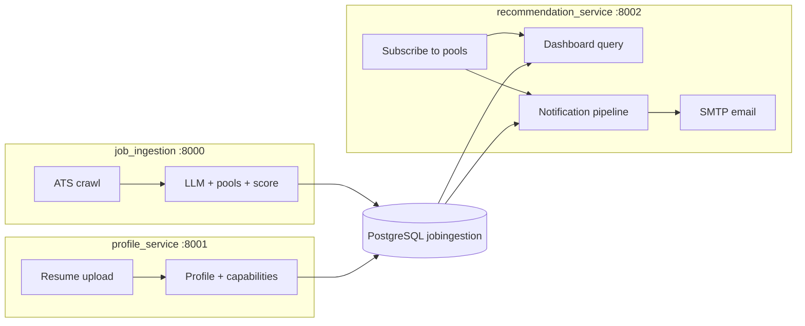

# What's been done

The plan is implemented across two parts in the monorepo:

## Part A — `job_ingestion/` (job enrichment extensions)

When a job is LLM-enriched successfully, the pipeline now also computes recommendation fields:

| Step | What happens |
|------|----------------|
| LLM extraction | Adds `normalized_roles`, `job_capabilities`, `application_effort`, `salary_min`, `salary_max` |
| Deterministic | `assign_retrieval_pools()` → e.g. `ML_ENGINEER_INTERNSHIP` |
| Deterministic | `compute_opportunity_score()` → global 0–1 score |
| Storage | Written to both `normalized_jobs` (current state) and `job_enrichments` (history) |

Key files:
- [`job_ingestion/app/ingestion/recommendation_fields.py`](job_ingestion/app/ingestion/recommendation_fields.py)
- [`job_ingestion/app/ingestion/extractor/llm.py`](job_ingestion/app/ingestion/extractor/llm.py)
- [`job_ingestion/app/ingestion/enrichment_worker.py`](job_ingestion/app/ingestion/enrichment_worker.py)
- Migration: [`20260607_0007_recommendation_enrichment_fields.py`](job_ingestion/alembic/versions/20260607_0007_recommendation_enrichment_fields.py)

Jobs without `opportunity_score` are invisible to the recommendation service.

## Part B — `recommendation_service/` (new service, port 8002)

A standalone FastAPI app that reads from the shared `jobingestion` PostgreSQL DB:

| Feature | Endpoints / behavior |
|---------|---------------------|
| Pool subscriptions | `POST/GET/PATCH /subscriptions` |
| Dashboard | `GET /dashboard/jobs`, `GET /dashboard/jobs/{job_id}` |
| Notifications | APScheduler every 3h + `POST /notifications/run` |
| Email | Jinja2 HTML template + SMTP |

New tables (own migration): `user_pool_subscriptions`, `notification_batches`, `notification_job_history`.

**Not built in V1:** dashboard UI, auto pool derivation from profile, vector/semantic search.

---

# How the full flow works



1. Jobs get enriched with pools + scores at ingestion time.
2. A candidate exists in `profile_service` with constraints, preferences, capabilities.
3. You manually subscribe the candidate to one or more pools (e.g. `SWE_FULLTIME`).
4. Dashboard returns jobs in those pools, sorted by `opportunity_score`.
5. Notification pipeline finds new jobs, applies hard filters, ranks personally, emails top 4.

---

# Prerequisites

0. **Shared Python environment** (once, from repo root):
   ```bash
   ./scripts/setup-env.sh
   source job-crawler/bin/activate
   ```

1. **Postgres running** with all three migrations applied:
   ```bash
   cd job_ingestion && alembic upgrade head
   cd profile_service && alembic upgrade head
   cd recommendation_service && alembic upgrade head
   ```

2. **Three services running** (separate terminals, from repo root):
   ```bash
   ./scripts/dev-job-ingestion.sh
   ./scripts/dev-profile-service.sh
   ./scripts/dev-recommendation-service.sh
   ```

3. **Jobs with recommendation fields populated** — this is the critical gate. Existing jobs need v2 re-enrichment or they'll return empty dashboard results.

---

# End-to-end testing (manual)

## Step 1 — Verify jobs have pools and scores

Check how many jobs are recommendation-ready:

```sql
SELECT
  COUNT(*) AS total,
  COUNT(*) FILTER (WHERE opportunity_score IS NOT NULL) AS with_score,
  COUNT(*) FILTER (WHERE cardinality(retrieval_pools) > 0) AS with_pools
FROM normalized_jobs
WHERE processing_state = 'success';
```

If `with_score` is low/zero, re-enrich via the ingestion API (uses Gemini, costs tokens):

```bash
# Dry run first — see how many match
curl -X POST http://localhost:8000/reprocessing/jobs \
  -H 'Content-Type: application/json' \
  -d '{
    "filters": {"processing_state": ["success"]},
    "target_version": "v2",
    "dry_run": true
  }'

# Then run for real (704 jobs were eligible last time)
curl -X POST http://localhost:8000/reprocessing/jobs \
  -H 'Content-Type: application/json' \
  -d '{
    "filters": {"processing_state": ["success"]},
    "target_version": "v2",
    "dry_run": false
  }'
```

Spot-check a job:

```sql
SELECT title, normalized_roles, retrieval_pools, opportunity_score, application_effort
FROM normalized_jobs
WHERE opportunity_score IS NOT NULL
LIMIT 5;
```

## Step 2 — Get or create a candidate with a profile

If you already have your export in the DB, use that candidate ID from [`exports/yatharthmogra-profile-export.md`](exports/yatharthmogra-profile-export.md):

```
6230dd88-b346-4e96-94fd-4a51c4500f34
```

Or create a fresh one via profile service:

```bash
export API_KEY=dev-key-change-me

curl -X POST http://localhost:8001/candidates \
  -H "X-API-Key: $API_KEY" \
  -H "Content-Type: application/json" \
  -d '{"email":"test@example.com","name":"Test User"}'
```

Upload a resume, commit the patch, and confirm profile + capabilities exist:

```bash
curl http://localhost:8001/candidates/CANDIDATE_ID/profile -H "X-API-Key: $API_KEY"
curl http://localhost:8001/candidates/CANDIDATE_ID/capabilities -H "X-API-Key: $API_KEY"
```

## Step 3 — Subscribe to retrieval pools

Pool names follow `{ROLE}_{TYPE}`:

| Examples | Meaning |
|----------|---------|
| `SWE_FULLTIME` | General SWE, full-time |
| `ML_ENGINEER_INTERNSHIP` | ML engineer internship |
| `BACKEND_ENGINEER_NEW_GRAD` | Backend new grad |

Pick pools that match jobs in your DB (from the SQL spot-check above):

```bash
export CANDIDATE_ID=6230dd88-b346-4e96-94fd-4a51c4500f34

curl -X POST http://localhost:8002/subscriptions \
  -H 'Content-Type: application/json' \
  -d "{
    \"candidate_id\": \"$CANDIDATE_ID\",
    \"pool_names\": [\"SWE_FULLTIME\", \"ML_ENGINEER_FULLTIME\"]
  }"
```

Verify:

```bash
curl http://localhost:8002/subscriptions/$CANDIDATE_ID
```

## Step 4 — Test dashboard retrieval

```bash
curl "http://localhost:8002/dashboard/jobs?candidate_id=$CANDIDATE_ID&limit=10"
```

Expected: JSON with `jobs` sorted by `opportunity_score` descending, and a `total` count.

Optional filters:

```bash
curl "http://localhost:8002/dashboard/jobs?candidate_id=$CANDIDATE_ID&remote_type=remote&salary_min=100000"
```

Single job detail (pick a job ID from the list):

```bash
curl "http://localhost:8002/dashboard/jobs/JOB_ID?candidate_id=$CANDIDATE_ID"
```

**If you get empty results**, check in order:
1. Candidate has active subscriptions
2. Jobs have `opportunity_score IS NOT NULL`
3. Pool names overlap job `retrieval_pools`
4. Hard constraint filters aren't excluding everything (sponsorship, internship_only, minimum_salary)

## Step 5 — Test notification pipeline + email

Configure SMTP in `recommendation_service/.env`:

```
SMTP_HOST=smtp.gmail.com
SMTP_PORT=587
SMTP_USE_TLS=true
SMTP_USERNAME=your@gmail.com
SMTP_PASSWORD=your_app_password
EMAIL_FROM=Career Match AI <your@gmail.com>
```

Trigger manually:

```bash
curl -X POST http://localhost:8002/notifications/run
```

What should happen:
1. Creates a `notification_batches` row per subscribed candidate
2. Finds new jobs in pools (not previously sent)
3. Applies constraint filters in SQL
4. Ranks top 4 personally
5. Sends HTML email with match explanations
6. Records rows in `notification_job_history` (dedup forever)

Verify in DB:

```sql
SELECT status, jobs_in_pools, jobs_after_filter, jobs_sent, skip_reason, email_delivered
FROM notification_batches
ORDER BY created_at DESC
LIMIT 5;

SELECT rank_in_batch, recommendation_score, explanation
FROM notification_job_history
WHERE candidate_id = '6230dd88-b346-4e96-94fd-4a51c4500f34'
ORDER BY created_at DESC;
```

Run notifications again — the same jobs should **not** be re-sent (unique constraint on `(candidate_id, job_id)`).

---

# Quick automated smoke test

There's a script that backfills 25 jobs with heuristic pools/scores and validates dashboard query logic:

```bash
cd /Users/yatharth/code/job-crawler
python recommendation_service/scripts/validate_e2e.py
```

Expected output:
```
dry_run matched_jobs=704
backfilled_jobs=25
subscribed candidate to pool=SWE_FULLTIME
dashboard_jobs=10 pools=['SWE_FULLTIME']
e2e validation complete
```

This is a **smoke test**, not full LLM re-enrichment. It uses title heuristics for the backfill, not Gemini.

---

# Unit tests

```bash
cd job_ingestion && python -m pytest tests/ -q          # 32 tests
cd recommendation_service && PYTHONPATH=. python -m pytest tests/ -q  # 4 tests
```

---

# What's still on you for a "real" E2E

| Item | Status |
|------|--------|
| Full LLM re-enrichment of all jobs | Optional — run reprocessing API |
| SMTP credentials for email | Required for notification step |
| Dashboard UI | Not built — use curl/API only |
| Auto pool subscription from profile roles | Not built — manual `POST /subscriptions` |
| profile-review-ux integration | Not wired to recommendation service |

---

If you want, switch to **Agent mode** and I can run the full E2E against your local DB (re-enrichment, subscription setup, notification trigger) and report back what worked.